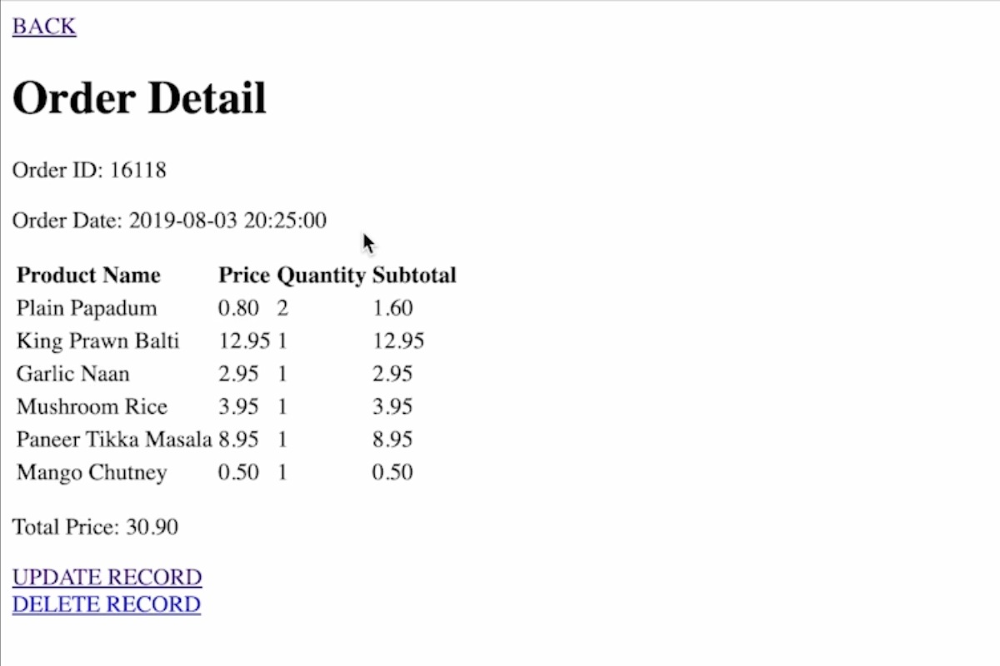

# Restaurant Orders

## About

This application is a web-based platform built with Django that processes takeaway food orders from two Indian restaurants in London. It involves creating models for orders and products, utilizing Django's ORM for database interactions, and implementing RESTful APIs using Django REST Framework. The application features essential CRUD operations, data validation, and serialization. It also supports unit testing and includes a script for bulk loading data from CSV files. The dataset used is sourced from Kaggle and focuses on the first restaurant to limit database entries.
